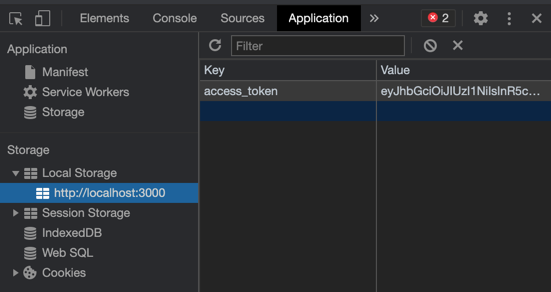
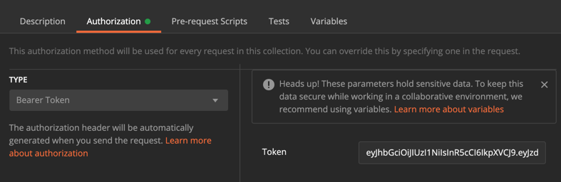
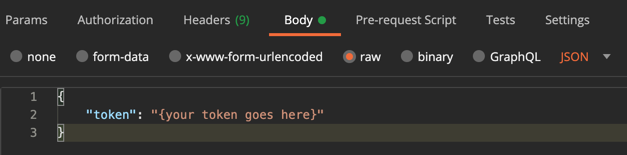

# `@ceres/api`

Backend API for Gitlab Analzyer

## Setup

Follow the instructions in the [root README](../../README.md) on how to start Docker, install packages, and link
dependencies. Also be sure to build the types packages before following these instructions. After you're done that, here
are instructions:

1. `npm run build`: This will make sure dependency links are setup properly and build the migration files.
2. `npm run migrate`: This will run all migrations on the database. By default, this will run on your docker postgres
   container.
3. `npm run start:dev`: This will start the api server at `http://localhost:4000`.

## Usage with Postman

In order to use the api with Postman, you will need to obtain an access token. The easiest way to this is start the
webapp. Login to the webapp via SFU and then open console and get the `access_token` from local storage.

In Postman, open up the **Authorization** tab for a request or collection. Select **Bearer Token** and paste in your
token.

You are now authenticated and can use the API from Postman!

### Setup Gitlab Token

Some requests will require you to have a Gitlab token setup to access the API. To do this, complete all the Postman
setup instructions above. Then generate and copy a Gitlab token. In Postman, setup a POST request
to `http://locahost:4000/token` and go into the **Body** tab.

Select the **Raw** radio button and set the content type to JSON. Set the body request to:

Send the request in and your Gitlab token should be stored in the database now!
